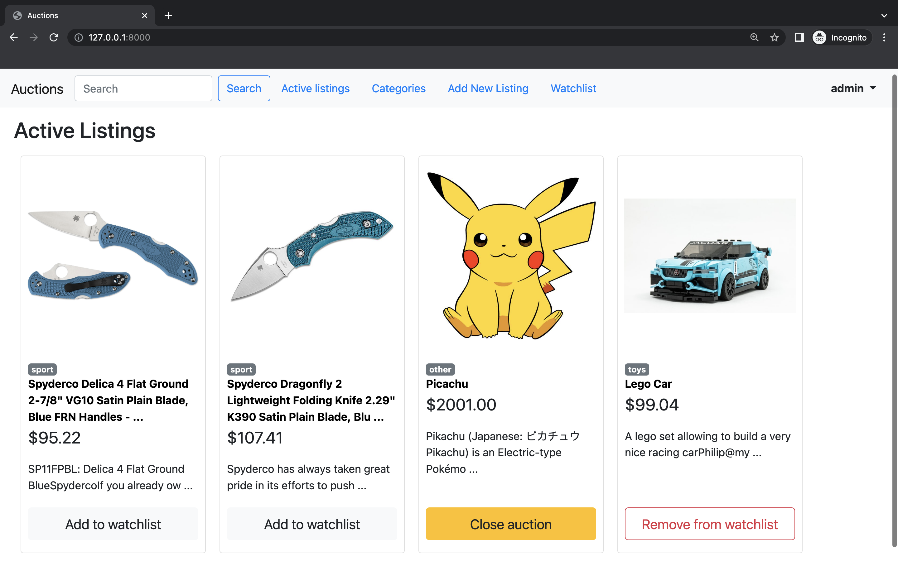
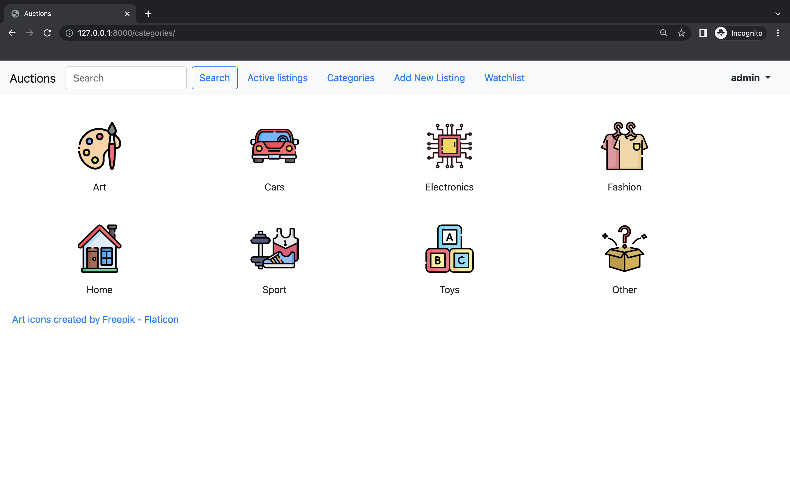
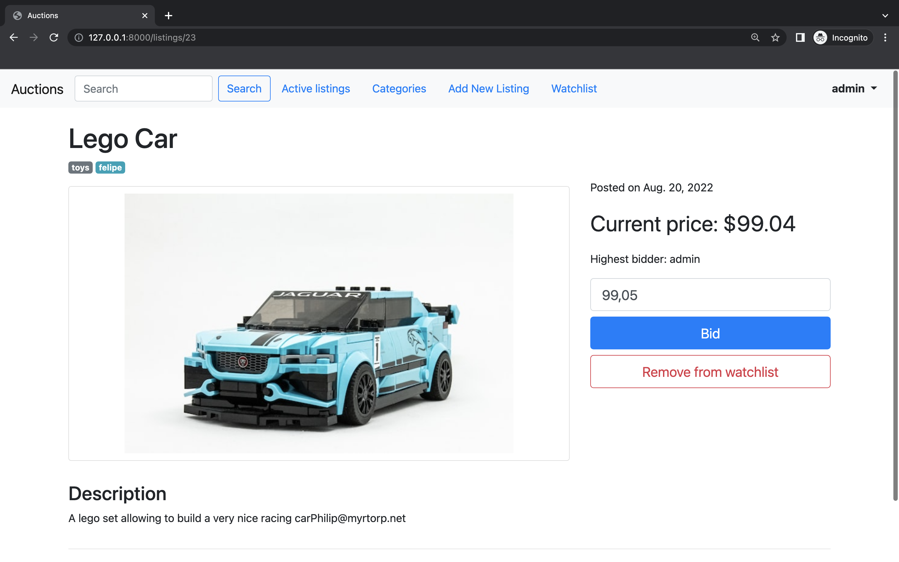
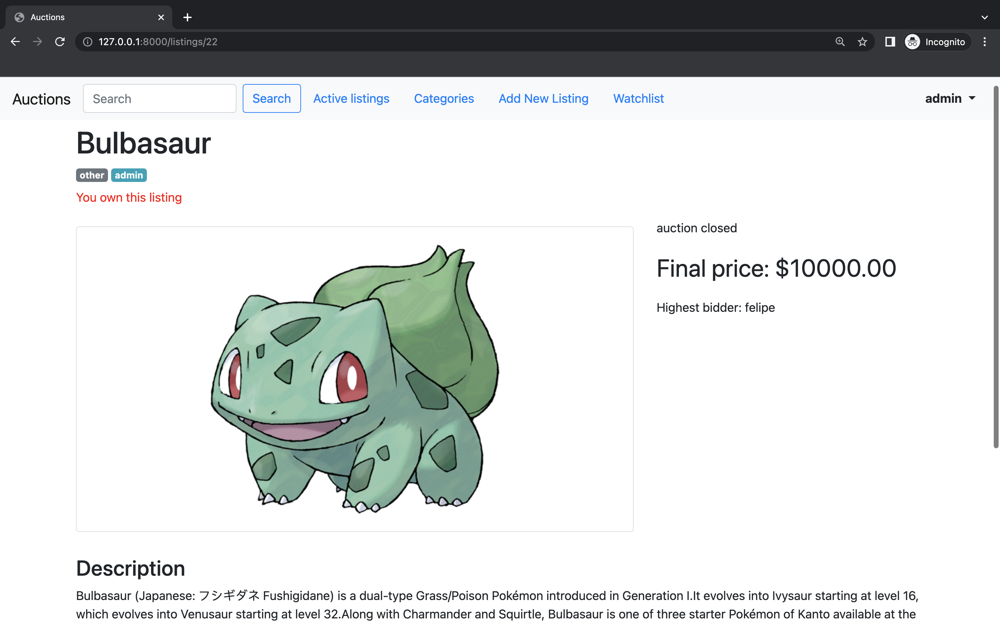
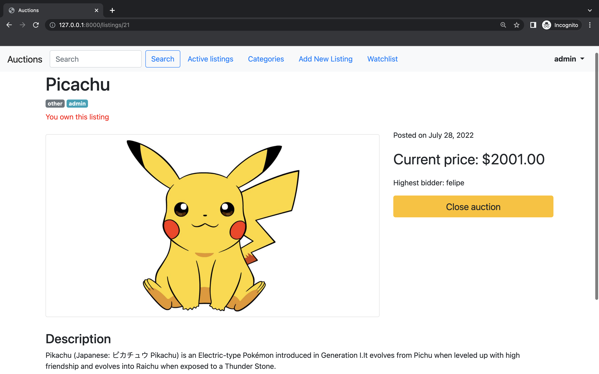
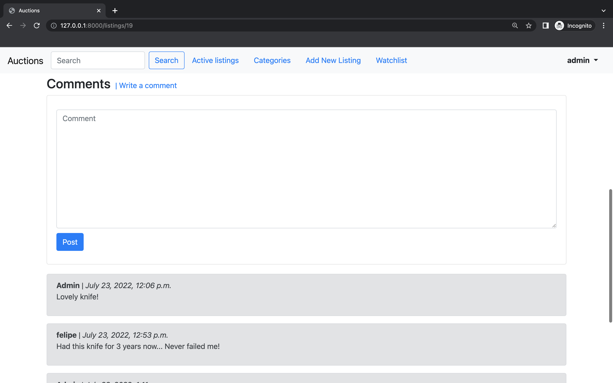

# CS50W_project_2

# THIS PROJECT IS STILL IN PROGRESS

####  eBay-like e-commerce auction site that will allow users to post auction listings, place bids on listings, comment on those listings, and add listings to a “watchlist.”

### Screenshot
more screenshots below.

### Video Demo:  TODO

### Technologies:
* Python
* Django
* SQLite
* HTML
* CSS
* Bootstrap

### Features
* Register/sign up
* List all existing listings
* View each individual listing
* Create and 'close' listings
* View listing categories
* Display listings by category
* Search for listing by name
* Add listings to your 'watchlist'
* Place bids
* ...

### Context
Project 2 for CS50's Web Development with Python and JavaScript.
Assignment specification: [https://cs50.harvard.edu/web/2020/projects/2/commerce/](https://cs50.harvard.edu/web/2020/projects/2/commerce/)

### screenshots

